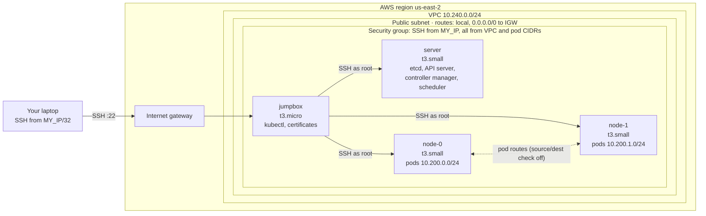
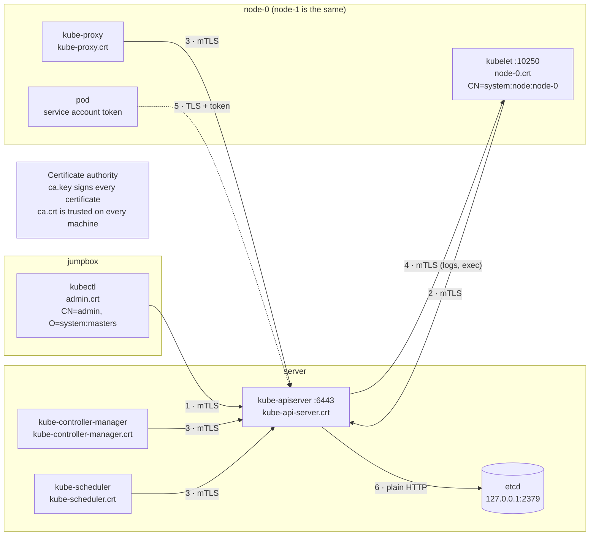

# Kubernetes The Hard Way on AWS

My notes from building a Kubernetes cluster by hand on AWS, following
[Kelsey Hightower's Kubernetes The Hard Way](https://github.com/kelseyhightower/kubernetes-the-hard-way),
with [Slawek Zachcial's AWS companion](https://github.com/slawekzachcial/kubernetes-the-hard-way-aws)
for the infrastructure.

No kubeadm, no EKS, no installers: every certificate, kubeconfig, systemd unit and route was created by hand.

> This is a learning cluster, not a production setup.

## What I built

| Component | Version |
|---|---|
| Kubernetes | v1.32 |
| containerd | v2.1 |
| CNI plugins | v1.6 |
| etcd | v3.6 |
| OS | Debian 12 on EC2 |

- A VPC, public subnet, internet gateway, route table and security group, created with the AWS CLI
- Four EC2 instances: a jumpbox (t3.micro) and server, node-0, node-1 (t3.small, 20 GB disks)
- My own certificate authority and a TLS certificate for every component
- etcd, kube-apiserver, kube-controller-manager and kube-scheduler on one control-plane machine
- Two worker nodes running containerd, the kubelet, kube-proxy and CNI bridge networking
- Routes between nodes so pods on different nodes can reach each other

## Architecture

## How components authenticate

| # | Connection | Type |
|---|---|---|
| 1–3 | kubectl, kubelets, kube-proxy, scheduler, controller manager → API server | mTLS: both sides present certificates signed by the CA |
| 4 | API server → kubelet (logs, exec, port-forward) | mTLS, plus an RBAC rule allowing user `kubernetes` |
| 5 | Pod → API server | TLS plus a service account token; pods have no client certificate |
| 6 | API server → etcd | Plain HTTP on localhost in this tutorial; mTLS in production |

More in [docs/pki.md](docs/pki.md). Editable versions of both diagrams are in [diagrams/](diagrams/).

## What I learned

- **A certificate's CN and O become the Kubernetes username and group.** Certificates prove identity; RBAC and the node authorizer decide what that identity may do.
- **Most connections are mutual TLS, but not all.** Pods authenticate with tokens signed by the API server, and in this setup etcd only listens on localhost.
- **On AWS, cross-node pod traffic silently disappears** until source/destination check is turned off, because the packets are addressed to pod IPs rather than the instance's own IP.
- **The CNI bridge plugin only knows about its own node.** Routes between nodes have to be added separately (Lab 11), which is what Calico, Cilium or the AWS VPC CNI automate.
- **Debugging is mostly reading `journalctl`.** My best bug: running a command from the wrong directory gave the CNI config an empty subnet, and every pod failed with `invalid CIDR address`.

## Repository layout

| Path | Contents |
|---|---|
| [docs/pki.md](docs/pki.md) | PKI from first principles, and how Kubernetes uses it |
| [docs/aws-networking.md](docs/aws-networking.md) | VPC, internet gateway, route tables, security groups and pod networking on AWS |
| [labs/](labs/) | Notes for each lab: what it does, why, AWS changes and problems I hit |
| [scripts/](scripts/) | AWS CLI scripts to provision, stop, start and clean up |
| [diagrams/](diagrams/) | draw.io source for the network and certificate diagrams |

## Running it yourself

1. Configure the AWS CLI with a named profile (`kthw` by default) and pick a region in [scripts/env.sh](scripts/env.sh).
2. `./scripts/01-provision.sh` creates the network and the four instances.
3. `./scripts/02-prepare-hosts.sh` writes `machines.txt`, enables root SSH and fixes `/etc/hosts`.
4. `./scripts/ssh-jumpbox.sh`, then follow Kelsey's labs from Lab 02 alongside the notes in [labs/](labs/).
5. `./scripts/cleanup.sh` deletes everything when you're done.

**Cost:** about $0.10/hour while running in us-east-2, and about $0.20/day while stopped (disks only). Check current EC2 pricing for your region.

## Credits

- [Kubernetes The Hard Way](https://github.com/kelseyhightower/kubernetes-the-hard-way) by Kelsey Hightower (CC BY-NC-SA 4.0). Its configs and lab commands aren't copied here; follow the original.
- [Kubernetes The Hard Way - AWS](https://github.com/slawekzachcial/kubernetes-the-hard-way-aws) by Slawek Zachcial, which the AWS scripts are based on.
